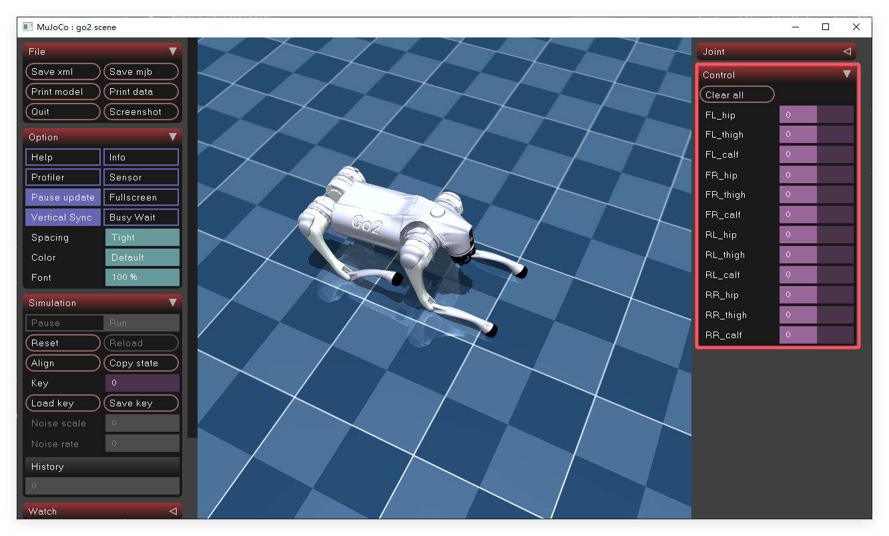

# Unitree Go2 仿真

## 项目简介

使用 [Mujoco 仿真环境]()训练 Unitree Go2 四足机器人，模型取自[谷歌 DeepMind github 仓库](https://github.com/google-deepmind/mujoco_menagerie/blob/main/unitree_go2/README.md)中的 MJCF 文件。

## 环境搭建

在 Windows 10 专业版系统下，使用 [Anaconda](https://www.anaconda.com/) 管理虚拟环境，环境信息及配置方式如下：

```cmd
conda create -n 你的环境名 python=3.10
conda activate 你刚刚创建的环境名
pip install torch torchvision torchaudio # 具体情版本况由你的电脑决定
pip install gymnasium==0.28.1
pip install gymnasium[mujoco]
pip install tensorboard
pip install wandb # 可选，如果使用需要创建 wandb 账号
pip install tyro
```

所有必要的库安装完毕，接下来，现在本地克隆本仓库

```cmd
git clone https://github.com/jlxz123/Mujoco_Go2_Trainer.git
```

克隆完成之后，转到该项目文件夹

```cmd
cd Mujoco_Go2_Trainer
```

或者在文件夹 `Mujoco_Go2_Trainer` 打开你的 pycharm 或者 vscode 即可。

## 运行代码

### Go2_rl/scripts/view_robot.py

可视化 Go2 3D 模型，运行之后出现 GUI 界面，可以点开右侧栏目中 Control 部分手动对机器人进行控制。



### Go2_rl/scripts/train.py

用 gymnasium 库管理仿真环境，使用 ppo 算法（目前仅支持该算法）进行机器人的行走训练，并使用 tyro 库管理训练配置，使用方法如下：

`win` + `R` 输入 `cmd` ，打开命令行面板，转到 Mujoco_Go2_Trainer 文件夹，或者直接在该文件夹下打开 pycharm 或 vscode ，拉取终端，输入如下命令

```cmd
python Go2_rl/scripts/train.py --变量名1 变量值1 --变量名2 变量值2 ...
```

具体用法学习 [tyro 官方教程](https://pypi.org/project/tyro/)，具体配置参数查看 Go2_rl/scripts/train.py 中的 `Args` 类。

最终模型会保存在 `Mujoco_Go2_Trainer/models` 文件夹下。

如果你使用了 wandb ，相关信息会保存在 `Mujoco_Go2_Trainer/wandb` 文件夹

### Go2_rl/scripts/play.py

加载已经训练好的模型，进行演示（默认一分钟，可以用 tyro 修改），视频以 `.mp4` 格式保存在 `Mujoco_Go2_Trainer/videos` 文件夹下。
